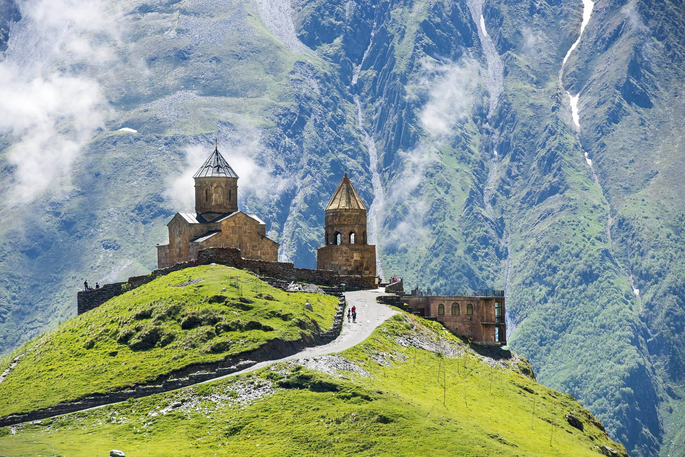

## Wstęp

Gruzja jest moim ulubionym krajem. Ten mało znany kraj jest zaskakująco bogaty w piękne zabytki, widoki i inne atrakcje. **To czyni go jedną z najlepszych destynacji na wakacje w Europie.**

Gruzja jest świetnym miejscem dla miłośników zabytków. Możemy tam znaleźć mnóstwo pozostałości dawnego ZSRR, jak i prastare budowle z epoki bronzu. Miasta Gruzji mają swój własny, unikatowy styl, którego nie znajdziemy nigdzie indziej na świecie. Bardzo kolorowe ceglane budynki ze zdobionymi,  drewnianymi balkonami wyglądają jak połączenie architektury Kuby i Włoch. W całym kraju możemy też znaleźć bardzo charakerystyczne kamienne wieże, które były używane do obrony przed najeźdźcami.

## Atrakcje Gruzji

Oto lista najciekwszych atrakcji Gruzji:

* Kanion Martvili - spływ kajakowy pośród skał 
* Vardzia - miasto wykute w skalnym klifie
* Klasztor Katskhi - świątynia na słupie skalnym
* Tbilisi - kolorowa stolica Gruzji
* Mestia - górska wioska pełna kamiennych wież
* Uplistsikhe - rozległe ruiny skalnego miasta
* Cminda Sameba - piękny kościół na szczycie góry
* Zamek Chertwisi - ponure ruiny twierdzy na skale

- ii
- ii

## Kuchnia Gruzji

Oto najciekawsze dania kuchni ormiańskiej:

### Khinkhali
Khinkhali to pierogi w formie torebek, których ciasto przypomina Polskie pierogi. Jednak nadziewa się je surową wołowiną i rosołem. Mięso gotuje się podczas gotowania pieroga.

### Chaczapuri
Chaczapuri to popularne w całej europie gruzińskie wypieki. Najbardziej autentyczne jest z jajkiem sadzonym i białym kozim serem. Spotyka się też chaczapuri wypełnione szpinakiem, mięsem czy nawet na słodko.

### Wino
Wino z Gruzji znane jest na całym świecie. Ciepły klimat i górzysty teren tego kraju jest idealny do uprawy winogorom.

## Miasta Gruzji

\begin{alertblock}{Tbilisi}
Tbilisi to stolica Gruzji. Jej kolorowe budynki z unikatową architekturą przyciagają turystów z całego świata.
\end{alertblock}

\begin{block}{Kutaisi}
Kutaisi to miasto w zachodniej Gruzji. Możemy w nim odwiedzić piękne kościoły i jaskinie otwarte do zwiedzania.
\end{block}

\begin{exampleblock}{Batumi}
Batumi to miasto na wybrzeżu Morza Czarnego. Charakteryzuje się wieżowcami i nowoczesną architekturą.
\end{exampleblock}

## Krajobraz Gruzji

{ height=50% width=50%}

